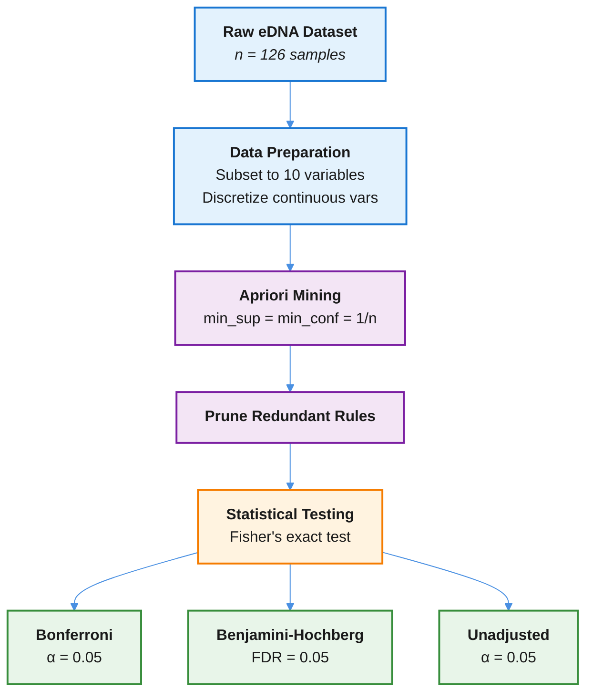

```mermaid
%%{init: {'theme':'base', 'themeVariables': { 'primaryColor':'#f0f7ff','primaryTextColor':'#1a1a1a','primaryBorderColor':'#4a90e2','lineColor':'#4a90e2','secondaryColor':'#e8f4f8','tertiaryColor':'#fff'}}}%%
flowchart TD
    A["<b>Raw eDNA Dataset</b><br/><i>n = 126 samples</i>"]
    B["<b>Data Preparation</b><br/>Subset to 10 variables<br/>Discretize continuous vars"]
    C["<b>Apriori Mining</b><br/>min_sup = min_conf = 1/n"]
    D["<b>Prune Redundant Rules</b>"]
    E["<b>Statistical Testing</b><br/>Fisher's exact test"]
    F["<b>Bonferroni</b><br/>α = 0.05"]
    G["<b>Benjamini-Hochberg</b><br/>FDR = 0.05"]
    H["<b>Unadjusted</b><br/>α = 0.05"]
    
    A --> B --> C --> D --> E
    E --> F
    E --> G
    E --> H
    
    classDef prep fill:#e3f2fd,stroke:#1976d2,stroke-width:2px
    classDef mine fill:#f3e5f5,stroke:#7b1fa2,stroke-width:2px
    classDef test fill:#fff3e0,stroke:#f57c00,stroke-width:2px
    classDef result fill:#e8f5e9,stroke:#388e3c,stroke-width:2px
    
    class A,B prep
    class C,D mine
    class E test
    class F,G,H result
```